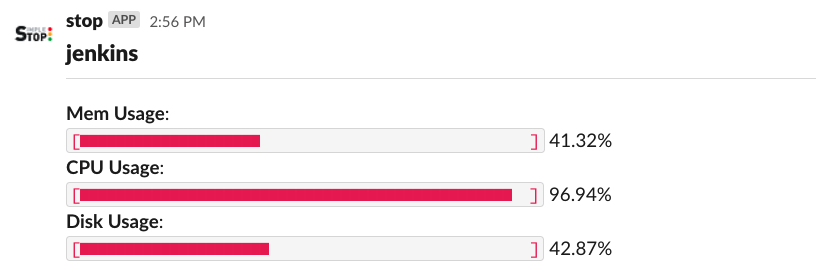

# stop-slack

Send notifications to Slack channel when server use more resources than the threshold you set.


### How to run?

```bash
docker run --name slack --env-file=<env file path> -d --rm <image>
```

### License

The MIT License (MIT) - see [LICENSE](../../LICENSE) for more details